# LAB 1 BLOG
* Download VSCode 

___

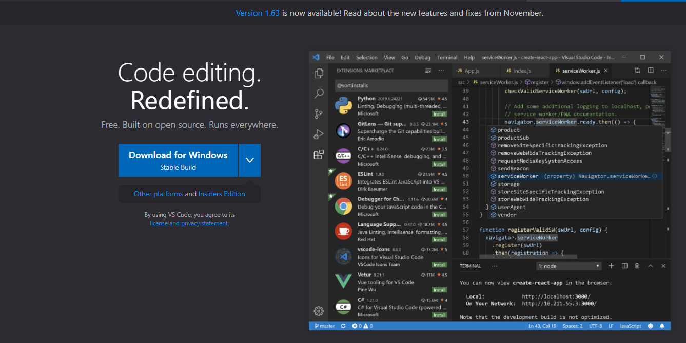
    For this step, go to [VSCode] https://code.visualstudio.com/, and download VSCode for whatever OS you have.
    Once you have downloaded VSCode you should be able to open it to a window that looks like this. 

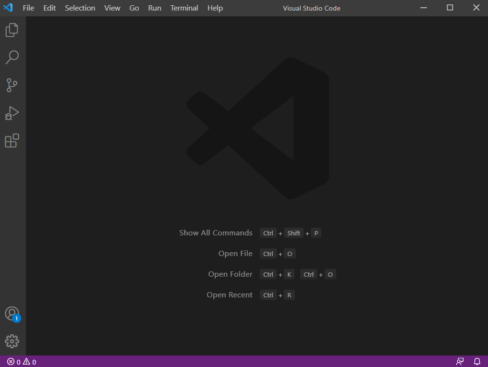

* Ensure you have OpenSSH on your computer

___

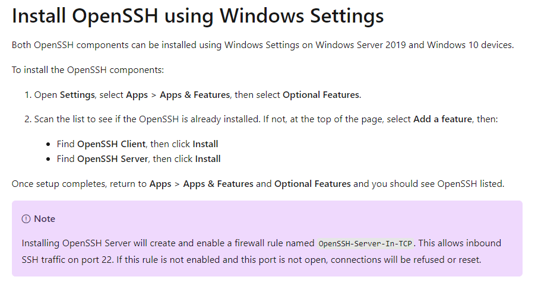

___

* Find out your student account information

___

Go to [AccountLookup] https://sdacs.ucsd.edu/~icc/index.php and type in your info (UserName and Student ID). 
After that you will get to a page that looks like this

___

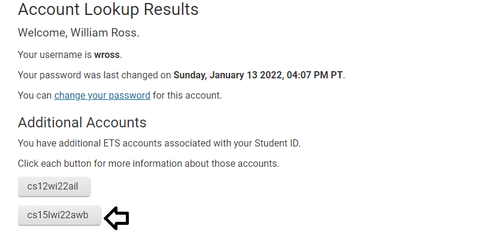

___

Click on the link that is related to the class you are in. For this class it is the one that starts cs15l as shown in the picture. 

___ 

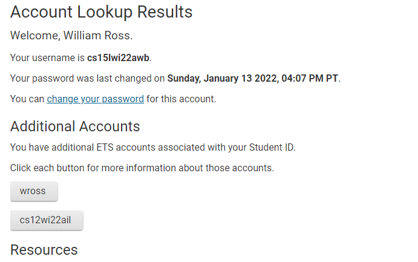

___

If this is your first time using this account, it will show something else where it says change password, and you will need to set a password or tell it to use your normal password for the new ieng6 account.

* Use VSCode to Remotely connect to the server

___
For this step you will want to open a terminal in VSCode and type in `ssh cs15lwi22zz@ieng6.ucsd.edu` where you replace the zz for the 3 letters in your personal account. Once you type this in you should be prompted with a line to enter your password.

___

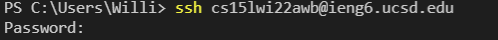

___
It will look like nothing is being typed, but if you enter your password correctly you will be signed in and get a message that looks like this.

___
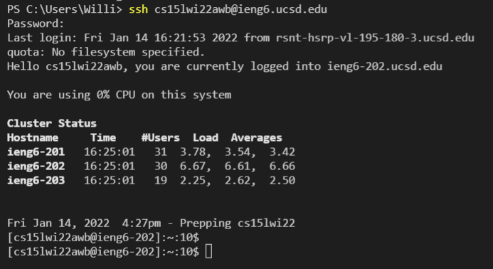

___

* Try Some Commands While Logged Into SSH

___
While you're logged into SSH you can try commands and see that they run on the server you're connected to.

___
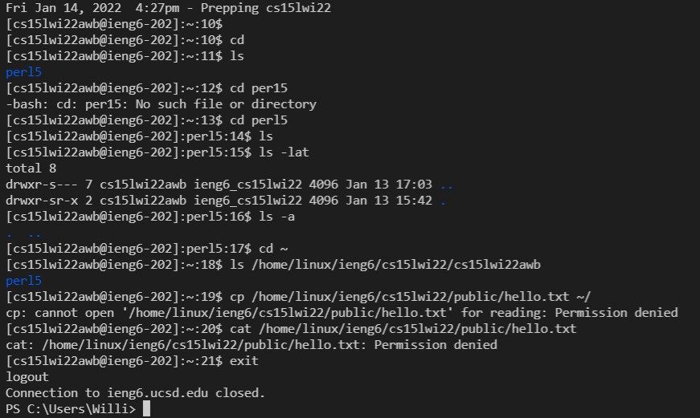

___
* Learn to Move Files With scp

___
Using scp, you are able to move files from your computer (the client) to a remote computer (the server). As you can see in the screenshot, we can send a file to the server and then log into the server and run it from there. 

___
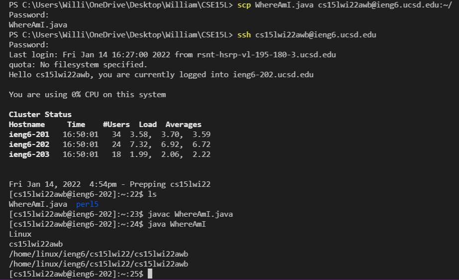

___
* Expediting the process

___
As you can see it takes a while to send your files to the Server then connect and run them. This process can be expedited using an SSH Key. An SSH Key is a way connect your computer to the server without having to type in your password every time you want to connect. To set one up you follow this link [SSH Key for windows] https://docs.microsoft.com/en-us/windows-server/administration/openssh/openssh_keymanagement#user-key-generation.
On this page follow the steps in your VSCode terminal until your page looks like this 

___
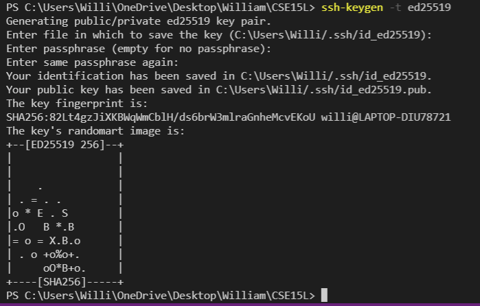

___

Once you have created your key, you must send one to the remote server. To do that you need to go to the remote server, create a folder for the key to go, and then send your key to the remote server from the client. 

___
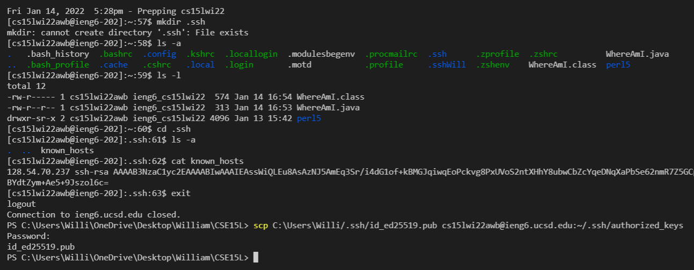

___
* Optimizing Remote Running

___
Once you no longer have to login to access the remote server every single time there are several ways to more quickly edit a file on the remote server. 
1. You can write a command in quotes to directly run it on the home directory of the remote server. 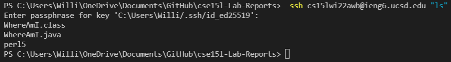
2. You can send multiple commands at the same time using semicolons. 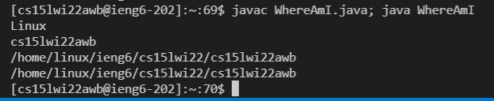

