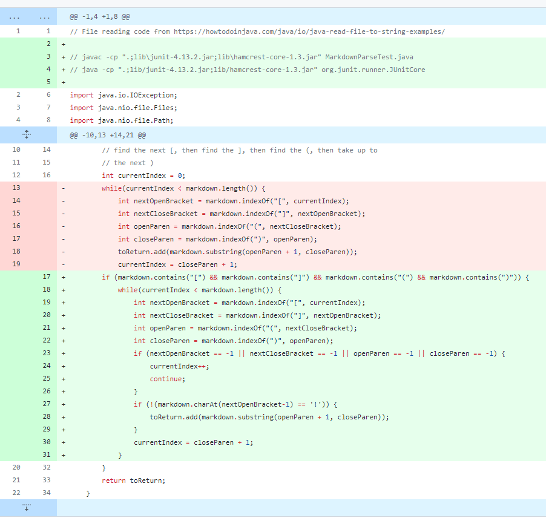
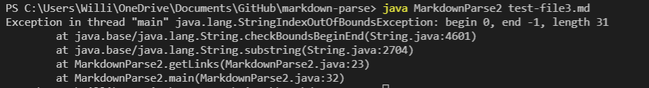
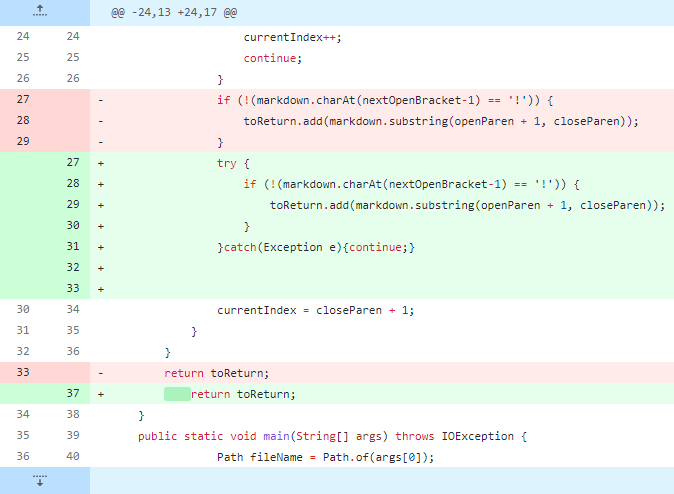
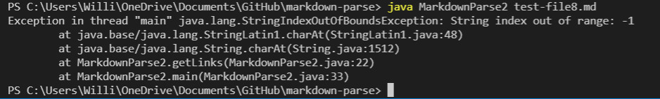
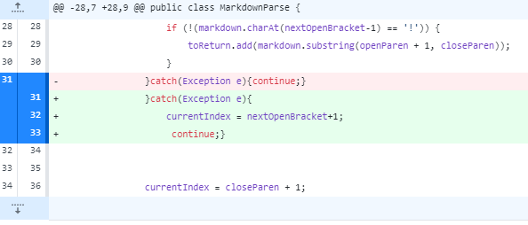
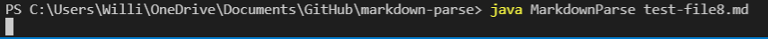

# Lab 2 Week 4
This week lab is focusing on testing for and resolving errors in our code. We have run code, created JUnit tests, and tried debugging the code to pass more cases.

___

* Error 1: The first Error we tried to fix was trying to get the program to not crash when copying a list that had did not have links, and to not copy image files.

___

___

We Ran this initial code against the [Third Test](https://github.com/ucsd-cse15l-w22/markdown-parse/blob/main/test-file3.md)
When run in the terminal, the error message we received was this 

This tells us that there was an index out of bounds exception at line 23 of our code. This is when we try to return a substring of closeParen, the index of the close parenthesis. But in our code, when there is no closed parenthesis the program returns -1 and so we are trying to get a substring of -1 which throws the exception.

___

* Error 2: By trying to fix the first error, we caused an IndexOutOfBounds Exception on any .md File which started with a link, so we then tried to fix that by catching the exception. This got rid of the exception but also made our code think images were links again.

___

___
After stopping the program from copying image files, we ran the  [Eighth Test](https://github.com/ucsd-cse15l-w22/markdown-parse/blob/main/test-file8.md), and got an IndexOutOfBounds exception as shown below 

This immage tells us that there is a problem with our code at line 22, which is where we check the character before the first open bracket to see if it is an "!". This causes an error because when the first open bracket is at index 0, it is then checking the digit at index -1 which causes an index out of bounds exception. We tried to fix this using a try catch block, which got rid of the error, but then led us into an infinite loop on Test 8.

* Error 3: The third error we had to fix was the infinite loop that was caused by our try catch block. This error meant the code was never moving past that block. 

___

___
When we run the [Eighth Test](https://github.com/ucsd-cse15l-w22/markdown-parse/blob/main/test-file8.md), we get an infinite loop that looks like is shown below.

The error tells us that there is somewhere in our code where the program continues running in the same loop indefinitely. We know is has to be in one of the places we just added because it was running before, so we know to look at the try catch block. From there we can see that if we catch an exception, we just continue, which would mean that we catch the same exception over and over and over again, causing an infinite loop. To fix this bug, we needed to make sure that once an exception was caught we would not catch the same one again, so we increase our current index by 1 to move past the problematic index. Once this is done, the output correctly return an empty List because there are no links in the File.
