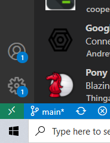
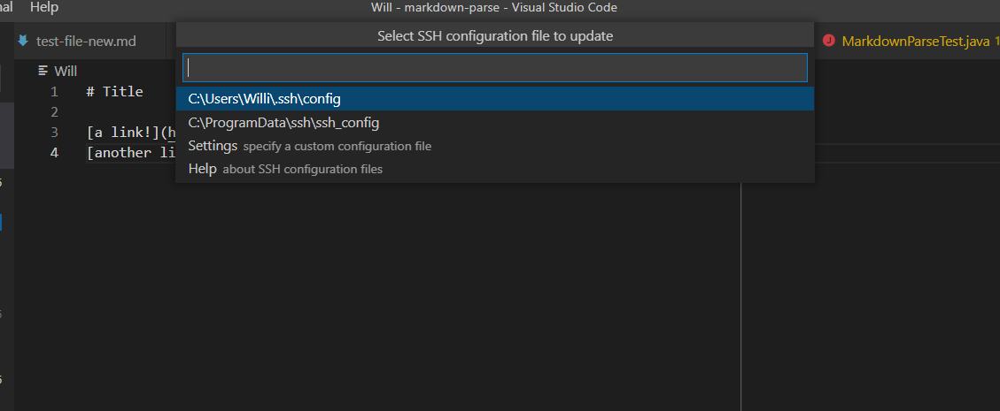
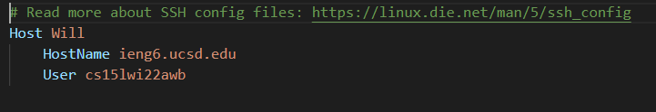
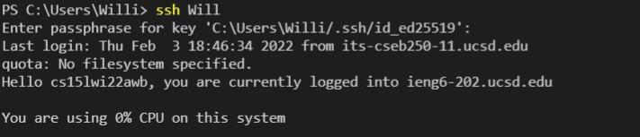
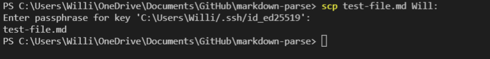

# LAB Report 3

## StreamLining SSH Configuration:

To streamline your SSH connection in VSCode, first download
the extention Remote - SSH on VSCode. Go to the extensions tab on the left and install it. 

Then, once you have downloaded it, a green set of arrows should show up on the bottom left corner of your screen. They look like this:

___

___
Click on these arrows, and it should open a bar at the top of your screen with various options. Click on the option labeled Open SSH configuration File. Once you do that another set of options should open up, and you should click on the one that takes you to your .ssh\config file. It should look like this:

___

___
Once you do this, a new text file should open up that looks like.

___

___
You need to fill in the host name with the server that you want to connect to, and the User tab with your username. The Host is the keyword that you will later use to tell your device you want to connect to this server. 

Once you have this page created, you can now just use the command ssh, followed by the name you filled in for Host in the previous step. It looks like this.

___

___ 
For me, this still requires me to fill in a password because on my own device a password is required to access the key that we created several labs ago, but if you chose not to have a password, this will log you into the ieng6 server with no further steps. 

This process can also be used to decrease the time it takes to scp a file, as you can use the same Host keyword to shorten this step. It looks like this

___

___ 
By Streamlining the ssh process, you are able to more quickly connect to various servers without having to remember your username, password, or the server's name. All you need to remember is what you named the Host in your SSH configure file. 