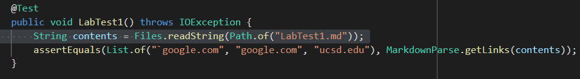
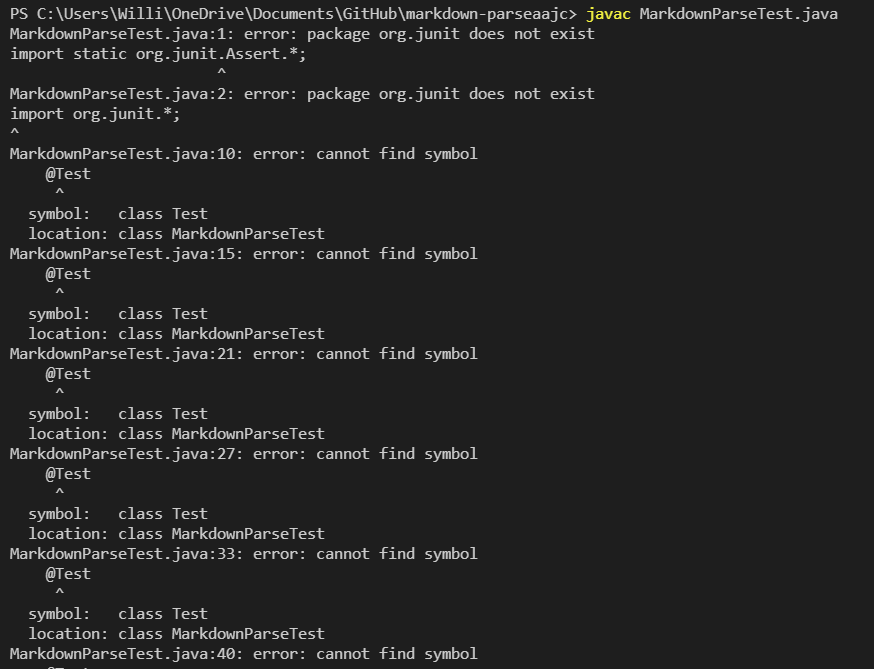

# Lab Report 4

Our group's markdown-parse [repository](https://github.com/wross3150/markdown-parse)

The repository we [Reviewed](https://github.com/aajc/markdown-parse)

# Snippet 1

The first Snippet should produce a list of links including: `google.com, google.com, ucsd.edu

I wrote this test for Snippet 1

My implementation Running this Test:

I had to add this file to my github in order to get the test to run, but when I did this, I got this output:

The repository we reviewed running this test:

For some reason, their test file would not compile, when I try to command javac MarkdownParseTest.java I get this output. 

___
I get the same output when I run on ieng6 and on my device, so I do not know what the issue is. 

When I just run their tests manually for the First snippet, The output is this 

___
The output they are supposed to get does not include the url.com link that their Markdown-parse copied.

# Snippet 2:

The Test I wrote for Snippet 2

As with the first snippet, I could only find the output for the Junit test in github, but the output I got was

I get the same error when I try to run the other groups tests on my device and on ieng6 for Snippet 2, so I can only manually compare the expected output and the output I get.

The expected output is [a.com, a.com(()), example.com]

but the output they get is [a.com, a.com((, example.com]

This suggests that both my parser and their parser end the link at the first close parenthesis, but we are supposed to wait until any open parenthesis in our link have been closed.

# Snippet 3

The Junit Test I wrote for Snippet 3 was as follows:

When I run this test on my code, I get this output:

This output means that our parser did not recognize that the we had a missing close parenthesis and needed to stop looking for the link when it could not find one. 

When I run this test on the code we were reviewing we get a different output:

We expect to get https://ucsd-cse15l-w22.github.io/
but instead we get an empty list.

- Question 1:
In order for our markdown-parser to correctly identify that the first item in the file is not supposed to be a link, we would have to recognize that the items within these (`) marks should be ignored. We could do this by saying if there are two of those characters, you should ignore the text between them. 

- Question 2: In order for our program to correctly identify the links in the file, we would have to count open parenthesis, and with each open parenthesis inside of the link we would have to find its matching close parenthesis, and have that close parenthesis not count towards closing the link. The code we would have to write to do this would take more than 10 lines, but it might be something like making a count of how many open parenthesis there are and then only closing the link when you have that many close parenthesis, but then it would cause problems if there were open parenthesis inside the link that were not closed.

- Question 3: I think there is a small change I could make in the code to make our code correctly read Snippet 3. The problem here is that we are supposed to stop looking for a close parenthesis when we skip to the next line in the markdown file, so we would just check if there is a newline character before the nextcloseParen variable, and if there was we would not copy what was in between the parenthesis.

