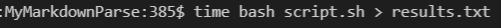
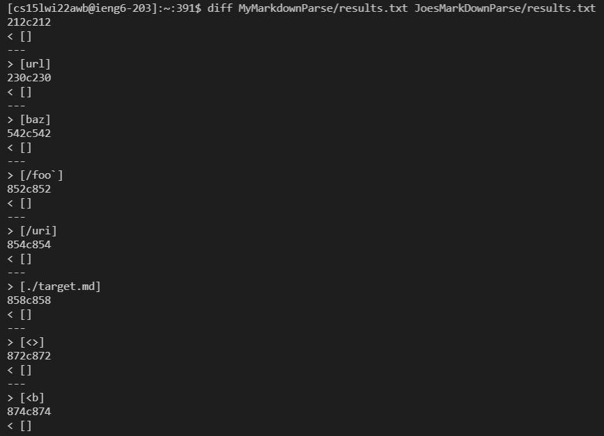
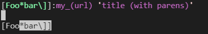
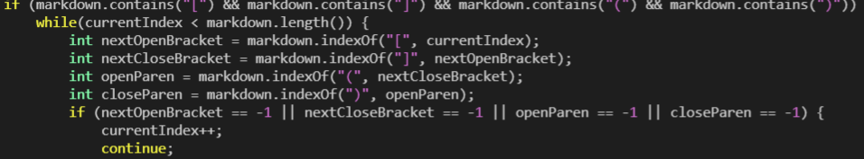
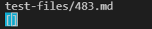
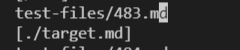
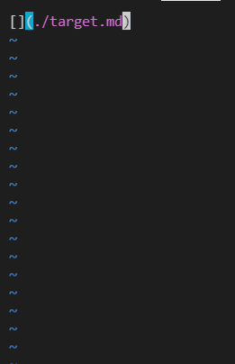
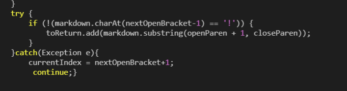

# Lab Report 5

___
To begin, I found the differences in my implementation and Joe's implementations of markdownParse, using the diff command. 

First I went into either directory, and copied the bash results to a file named results.txt

I did this in both the directory of my implementation of Markdown Parse, and the directory with Joe's implementation of Markdown parse. 

Then Once I had copied these results into a file, I went back to the main directory and used the Diff program to compare the files, as shown below.

This program prints a list of all the results that were different between the two files, showing me a list of which tests, my implementation had different results from Joe's.

# Problem 1

From these results, we can see that my test gave an empty array as a result of running test 212, whereas Joe's MDParse had a link of url in his array.

To see which implementation is correct, we can go to the test file, and see what the file contains. To do this, just go to the test file and vim 194.md

When we have this file in our own md file we see that it does give a link, so joe's implementation is correct.

To find out why we had the incorrect result, we have to look at the test file, and see why our code does not think it is a link.
For this example, it does not accept that there are two closed brackets in the link name.

 The code that should be fixed that contains this bug is 
 
 Our code fails because it will only pick up code if the file an open and closed bracket followed by a single open and closed parenthesis.
# Problem 2
Another  Error I found was in line 854, which is test 483. Our implementation gave us an empty array list, 

and the implementation from Joe gave us a link that looks like this

When we look at the contents of the file, we see that Joe's Parser was correct. 

This should obviously be accepted as a link, but our file does Parser does not accept it because the index of the first open bracket is 0, and when we check before it, we get an error, and catch the exception, but after catching the exception we do not still add the text to the array of links. 

We see in this code that whent he exception is caught we continue, but we never add the string between the parenthesis.
